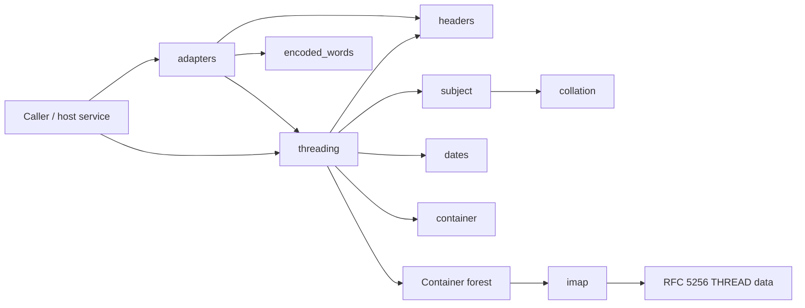
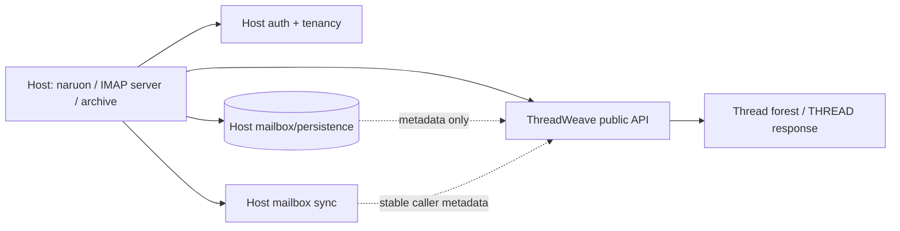
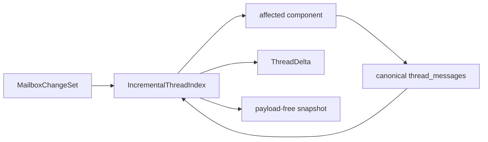
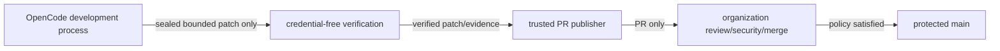

# ThreadWeave Architecture

**Status:** Accepted as-built architecture for protected `main` at `fb7dab5698ffd24b1a6db0943f1e387f0eda4d31`  
**Last reviewed:** 2026-08-09

## Architectural goal

ThreadWeave provides one deterministic email-threading kernel that remains useful as a zero-runtime-dependency standalone Python package and as a module inside a larger mail or knowledge service. Standards logic, transport presentation, host persistence, autonomous development, and release authority remain distinct boundaries.

## As-built component map



## Module ownership

| Boundary | Owns | Does not own |
|---|---|---|
| normalization (`headers`, `encoded_words`) | safe parsing/normalization of protocol text | mailbox storage, graph lifetime |
| comparison (`subject`, `collation`) | RFC 5256 base subject and RFC 5051 key | semantic topic classification |
| ordering (`dates`) | date normalization/order keys | scheduler clocks or persistence |
| graph (`threading`, `container`) | authoritative batch forest | IMAP sessions, database state |
| presentation (`imap`) | pure RFC 5256 projection/serialization | sockets, authentication, command dispatch |
| adapters | stdlib email conversion | ownership of source message payloads |
| GitHub automation | development/review/release evidence | runtime email behavior |

## Current authoritative flow

```text
mail metadata / stdlib email
→ normalize identifiers and header text
→ canonical batch thread_messages
→ optional subject fallback
→ optional sent-date ordering
→ Container forest
→ optional non-mutating IMAP projection
```

`thread_messages` is the only structural correctness oracle. Transport adapters and future incremental state must delegate structural reconstruction to it rather than reproducing the algorithm.

## Runtime trust boundary

ThreadWeave runtime code is deliberately capability-poor:

- no network client;
- no database driver;
- no subprocess/shell execution;
- no model or cloud credentials;
- no message-body rendering or active-content execution;
- no tenant/session/authentication state.

A caller may place arbitrary objects in `Message.payload`; the package treats those as opaque caller-owned references. Protocol output and future snapshots must not serialize arbitrary payload objects by accident.

## Host-service boundary



The host owns durable storage, tenant boundaries, authentication, distributed write serialization, mailbox sequence/UID lifecycle, audit, and API exposure. ThreadWeave does not read the host database directly.

## Ordering architecture

Sent-date ordering is optional to preserve backward compatibility. When enabled, date normalization is performed before RFC-defined sorting stages. An explicit `sequence_number`, when supplied, must be a positive mailbox sequence number. When it is omitted, the one-based `input_position` is used only as an internal ordering fallback. Effective ordering sequence values must be unique across all messages participating in sent-date sorting, because the implementation validates them before comparing dates. The input-position fallback is never exposed as, inferred to be, or persisted as a public IMAP sequence number.

## Presentation architecture

The IMAP serializer is a presentation boundary over a prebuilt forest. Search-result filtering produces a projection without mutating the source nodes. Invalid identifier state fails closed rather than being silently rewritten. This keeps threading correctness independent from IMAP session state.

## Active incremental target — not protected-main as-built

PR #20 proposes the following extension:



Until PR #20 merges, `IncrementalThreadIndex`, RFC 8474 identity tracking, snapshots, and incremental mailbox benchmarks are ACTIVE-PR architecture only. A process-local lock in that proposal is not a distributed lock; any durable multi-process host continues to own write serialization.

## Automation authority architecture



The development model never receives merge/release authority. Organization-central review/security workflows remain independent. Repository-controlled code must not inherit the NVIDIA model key, GitHub write credentials, or OIDC credentials from privileged workflow phases.

## Deployment modes

1. **Embedded library — current:** ordinary Python dependency inside a host process.
2. **Host adapter — supported architecture:** host exposes ThreadWeave through its own API/session/persistence layer.
3. **Standalone network service — not provided by this repository:** a separate service may wrap the library, but must own auth, tenancy, persistence, rate limiting, audit, and deployment controls itself.

## Failure behavior

Expected malformed email/protocol input is handled deterministically where a public error contract exists. Cycles/deep structures terminate safely. The library must not turn unexpected programming defects into successful structural output.

## Architectural change control

Changes to any of these require an ADR and synchronized PRD/TRD/UML/ERD/security/test/operability documentation:

- additional runtime capability or dependency;
- alternative threading oracle;
- persistence or network ownership;
- durable snapshot schema;
- external identity semantics;
- Unicode comparison contract;
- protocol authority beyond pure presentation;
- automation credential or merge-authority boundary.