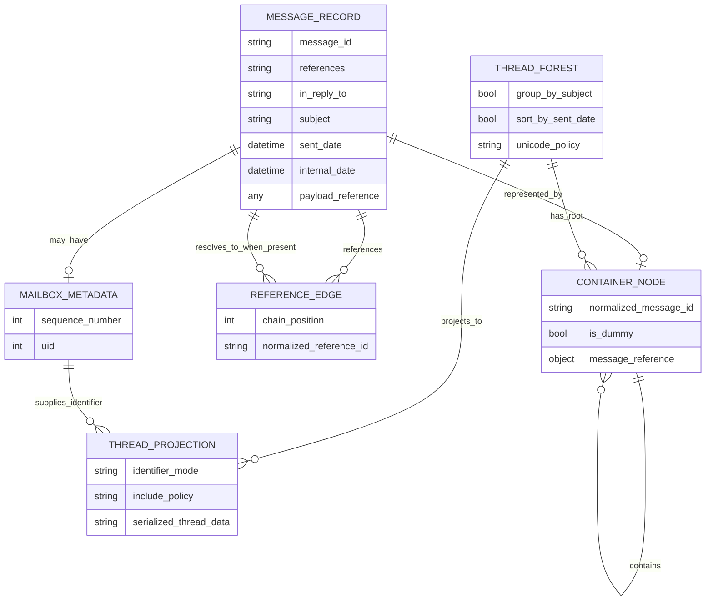
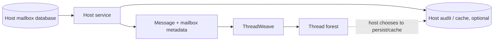
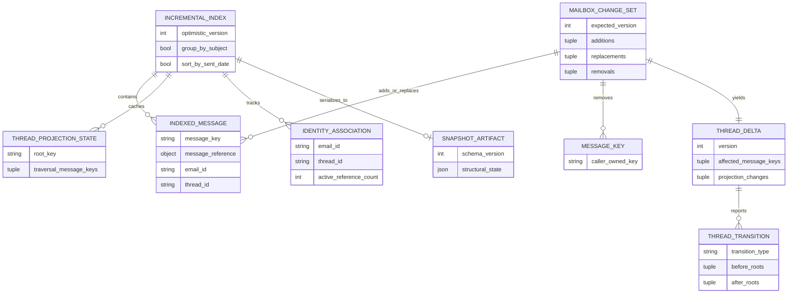

# ThreadWeave Conceptual Domain and Evidence Model

**Status:** Accepted conceptual model. ThreadWeave itself persists no database entities.  
**Last reviewed:** 2026-08-09

This document satisfies the repository's ERD/domain-model requirement without inventing persistence the package does not own. Solid entities describe current runtime concepts. Dashed/labelled active-PR concepts describe PR #20 only. Host persistence is external.

## Current conceptual model

These are **conceptual names**, not database table names and not necessarily Python class names. The as-built classes are chiefly `Message` and `Container`; a returned root list constitutes the conceptual `THREAD_FOREST`.

## Runtime ownership

- `MESSAGE_RECORD.payload_reference` is opaque and caller-owned.
- `MAILBOX_METADATA` is supplied by the host; ThreadWeave does not assign mailbox sequence numbers or UIDs.
- Dummy `CONTAINER_NODE` values represent missing ancestors and do not invent a `MESSAGE_RECORD`.
- `THREAD_PROJECTION` is derived output; it is not durable protocol/session state.
- Reference edges are derived from normalized RFC headers and need not be materialized as separate Python objects.

## Host persistence boundary

ThreadWeave does not define the host schema, tenant key, user key, mailbox table, retention policy, or authorization relation. A host may persist its own projection/cache, but it must version that contract independently rather than treating private Python object identity as a durable database identifier.

## Active incremental target — PR #20 only

**Maturity:** ACTIVE-PR / Proposed; PR #20 is **not protected-main as-built behavior**.

This second ERD is an **ACTIVE-PR conceptual target**. None of these entities may be described as protected-main persisted state until PR #20 or a successor is merged. Even after merge, the index remains process-local library state unless a separate host persists its documented snapshot.

## Identity rules

- `message_key` in the active target is caller-owned and stable across mutable IMAP sequence-number changes.
- `message_id`, RFC 8474 EMAILID/THREADID, sequence number, UID, and caller `message_key` are different identity domains and must never be conflated.
- Public IMAP sequence numbers and UIDs are validated protocol metadata, not storage primary keys for ThreadWeave.
- Python object identity is used for graph safety but is not a durable external identifier.

## Temporal rules

ThreadWeave is not a psychometric or temporal database, but ordering metadata still has explicit semantics:

- `sent_date` represents message header date evidence;
- `internal_date` is the mailbox fallback ordering value;
- `sequence_number` is a mailbox-position ordering/tie-break input when explicitly supplied; omitted values may use input position only as an internal sort fallback;
- none of these are transaction timestamps or host audit timestamps.

A host that persists snapshots or deltas should record its own transaction/system time and must not overload message dates for that purpose.

## Persistence acceptance rule

If ThreadWeave ever begins owning persistence directly, that is an architectural boundary change. It requires a new Accepted ADR, migration and rollback design, tenant/authorization model, operational/recovery contract, security/threat-model updates, and an as-built physical ERD. Until then, this document remains conceptual.