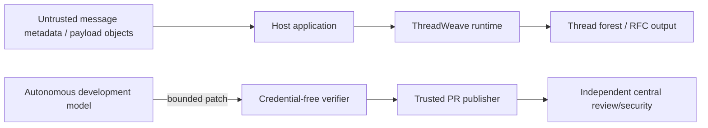

# ThreadWeave Threat Model

**Status:** Accepted baseline  
**Last reviewed:** 2026-08-09

## Scope

This model covers the ThreadWeave runtime library, pure IMAP projection, package/build supply chain, and repository autonomous-development boundary. Host mail storage/authentication is outside the package but its interface assumptions are included.

## Trust boundaries

## Threat inventory

| Threat | Boundary | Impact | Required controls |
|---|---|---|---|
| malformed/duplicate identifiers | header → graph | wrong parents, ambiguity, crash | normalization, duplicate handling, deterministic failure/fallback |
| cyclic/deep/shared graph | graph traversal | DoS or invalid tree | identity guards, iterative traversal, cycle tests |
| protocol identifier injection | forest → IMAP | response corruption/smuggling | exact integer/range/uniqueness validation, safe framing |
| malicious payload object | caller → runtime | accidental execution/serialization | payload opacity; reject executable/non-plain values at snapshot boundaries |
| Unicode confusable abuse | subject comparison | incorrect grouping/spoofing | protocol-defined casemap; do not collapse cross-script confusables |
| subject collision | optional grouping | unrelated messages merged | subject grouping opt-in, structural type rules, explicit tests |
| date manipulation | ordering | misleading presentation | documented normalization/fallback, exact tie-break validation |
| mutable supply-chain ref | CI/release | compromised build | immutable action SHAs, exact/hash-locked build tooling |
| secret leakage into tests/model | automation | repo/provider compromise | broker/secret stripping, clean verifier, credential fingerprint/leak tests |
| model self-approval/publication | automation authority | governance bypass | separated publisher/reviewer/merge/release identities |
| stale-head evidence reuse | merge/release | unverified code lands | exact-head checks/reviews and current protected-base reconciliation |
| unsafe future snapshot | incremental target | code execution/memory DoS/state forgery | exact schema/types, size/count bounds, payload exclusion, optimistic versioning |

## STRIDE interpretation

### Spoofing

External Message-ID/EMAILID/THREADID/UID values are data identifiers, not caller identity. Authentication is host-owned. Automation credentials must be bound to the correct trust phase and never inferred from model output.

### Tampering

Thread structure must be derived deterministically from validated metadata; filtered IMAP projection cannot mutate source containers. Build/release artifacts require exact source and locked-toolchain evidence.

### Repudiation

The library itself does not persist audit records. Host services are responsible for audit of mailbox mutations and external API use. GitHub retains PR/check/review evidence for development changes. Future incremental hosts should log expected/new index versions and source changes outside ThreadWeave.

### Information disclosure

The library exposes metadata supplied to its public APIs by design. It must not serialize arbitrary `payload` objects into snapshots or diagnostics. Automation secrets are prohibited from repository-controlled/model execution contexts.

### Denial of service

Pathological graph depth, cycles, huge reference sets, serializer shapes, and future snapshot structures must be bounded/iterative. Performance claims require realistic scale evidence rather than asymptotic assumptions alone.

### Elevation of privilege

Runtime has no privileged capability. Autonomous model execution cannot gain reviewer, protected-branch merge, tag, release, OIDC, or provider-secret authority by modifying repository files.

## Abuse cases and security tests

At minimum maintain tests for:

- cyclic references and source-container cycles;
- shared-node graphs rejected at serializer/snapshot boundaries;
- 3,000+ depth non-recursive threading/serialization paths where representative;
- duplicate/missing/boolean/out-of-range sequence and UID identifiers;
- CR/LF and malformed protocol-output attempts;
- unknown/malformed encoded words and reference headers;
- cross-script confusables remaining distinct under RFC 5051 keys;
- invalid/ambiguous sent-date metadata and tie conditions;
- package built/installed outside source tree;
- action SHA and dependency lock integrity;
- secret/credential absence from untrusted automation phases;
- hostile/malformed GitHub Actions registry, pull-request, and Git-tree API responses (truncated tree, repeated/mismatched pagination, duplicate workflow IDs, non-NFC/traversal-shaped workflow paths, oversized/non-UTF-8/duplicate-key JSON) fail closed in `scripts/ci/actions_registry_audit.py` rather than under-reporting a live orphan workflow identity (ADR-0010);
- if incremental lands: hostile/cyclic/aliased/oversized snapshot inputs and same-version concurrent writers.

## Residual risk

ThreadWeave cannot prevent a host from supplying wrong mailbox metadata, authorizing the wrong tenant, persisting private payloads insecurely, or presenting subject grouping as semantic truth. These are explicit host responsibilities and should be covered by the host's threat model.

## Review triggers

Revisit this threat model when runtime gains a dependency/capability, a new serialized format, persistence, network service behavior, new external identity type, changed Unicode algorithm, or changed autonomous/release credential flow.