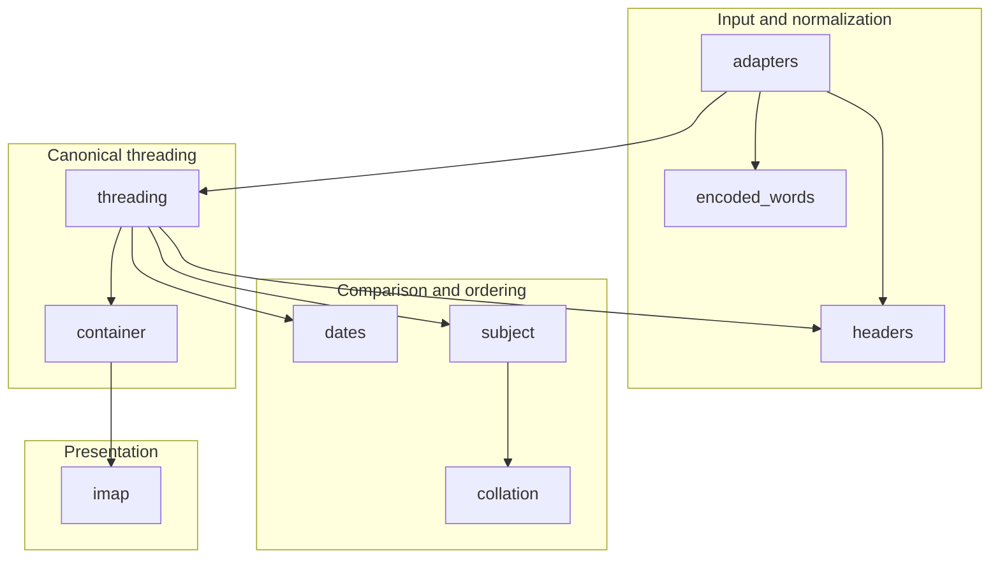
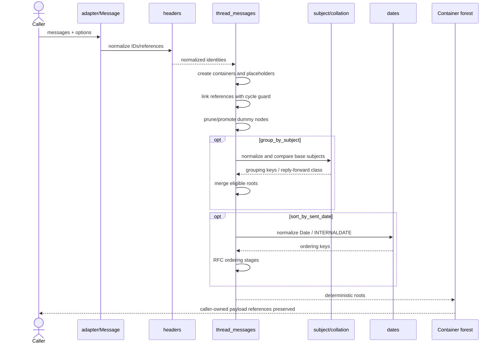
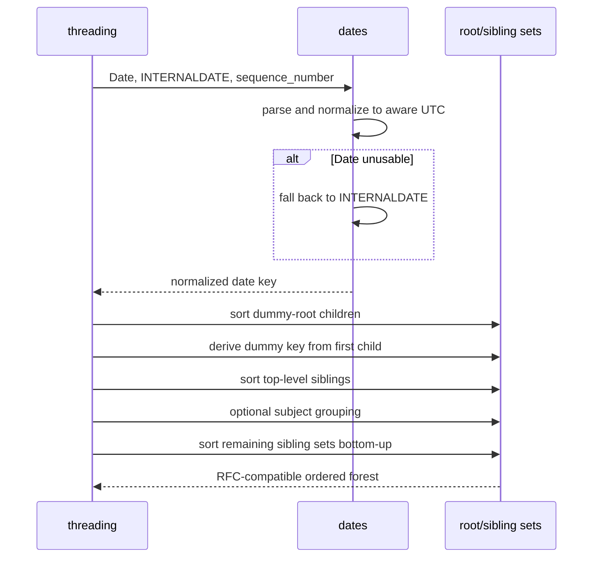
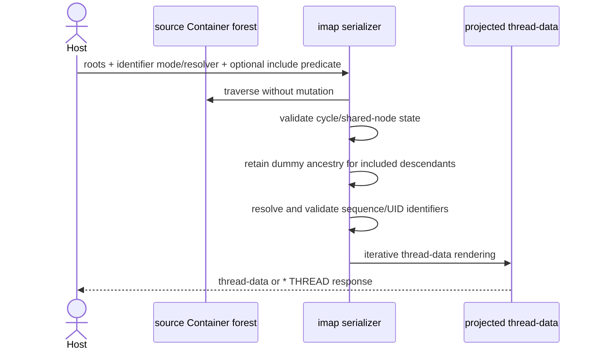
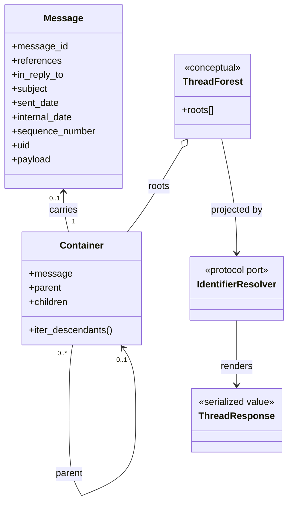
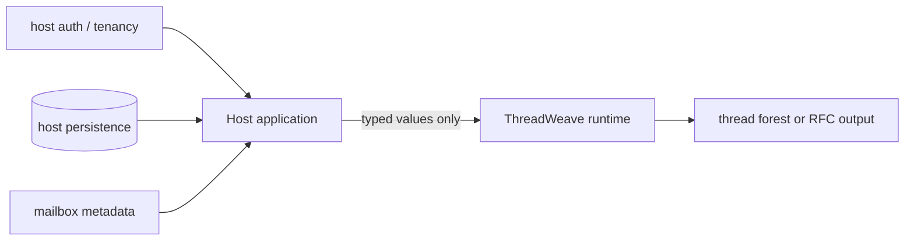
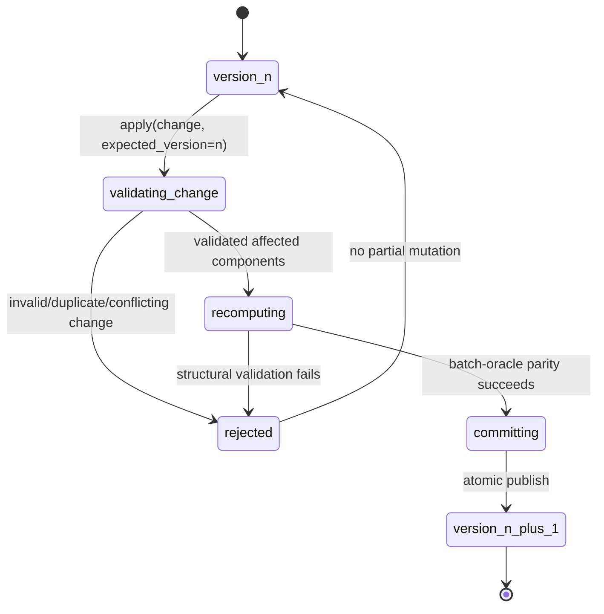
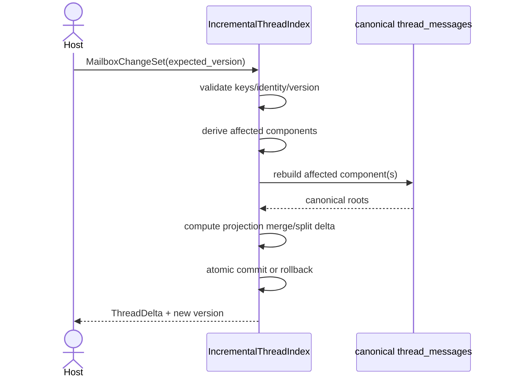
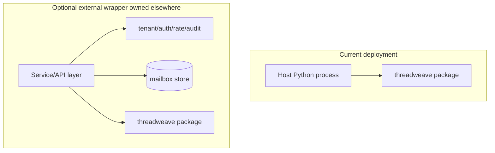

# ThreadWeave UML and Runtime Views

**Status:** Accepted diagrams for protected-main behavior plus explicitly labelled active-PR target views.  
**Last reviewed:** 2026-08-09

## Package/component view

## Batch threading sequence

## Sent-date ordering sequence

## IMAP projection sequence

## Batch object/class view

`ThreadForest` and `ThreadResponse` are conceptual documentation names, not additional persisted/runtime classes.

## Authority view

ThreadWeave has no authority to query the host database, authenticate a user, assign tenant ownership, or send network responses by itself.

## Active incremental state view — PR #20 target, not protected-main

These diagrams become as-built only if PR #20 merges. Until then they describe the active design under review.

## Deployment view

No database or service deployment is required to use the package.

## Maintenance rule

Update these views when module ownership, public lifecycle, protocol authority, durable state, automation authority, or deployment responsibility changes. Never move an ACTIVE-PR feature into the as-built diagrams until it is present on protected `main`.