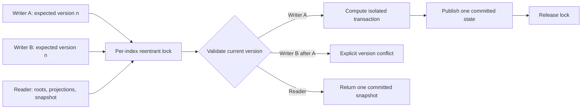

# Incremental mailbox threading

`IncrementalThreadIndex` applies mailbox additions, replacements, and removals
without rebuilding unrelated reference components. It delegates every affected
component to the same `thread_messages` batch implementation used by the public
batch API, so full reconstruction remains the correctness oracle.

The incremental layer is transport-neutral. It contains no database, network,
authentication, IMAP session, or JMAP state and can be used as a standalone
library or embedded in naruon and other services.

## Basic use

```python
from threadweave import (
    IncrementalThreadIndex,
    IndexedMessage,
    MailboxChangeSet,
    Message,
    serialize_thread_response,
)

index = IncrementalThreadIndex(sort_by_sent_date=True)

initial_delta = index.apply(
    MailboxChangeSet(
        expected_version=0,
        additions=(
            IndexedMessage(
                message_key="mailbox:101",
                message=Message(
                    message_id="<root@example.test>",
                    sent_date="1 Jan 2026 00:00:00 +0000",
                    sequence_number=1,
                    uid=101,
                ),
                email_id="Email_101",
                thread_id="Thread_7",
            ),
            IndexedMessage(
                message_key="mailbox:102",
                message=Message(
                    message_id="<reply@example.test>",
                    references="<root@example.test>",
                    sent_date="2 Jan 2026 00:00:00 +0000",
                    sequence_number=2,
                    uid=102,
                ),
                email_id="Email_102",
                thread_id="Thread_7",
            ),
        ),
    )
)

assert initial_delta.version == 1
assert index.projections[0].message_keys == (
    "mailbox:101",
    "mailbox:102",
)
assert serialize_thread_response(index.roots, identifier="uid") == (
    "* THREAD (101 102)\r\n"
)
```

The caller-owned `message_key` is the index identity. It must not be derived from
an IMAP sequence number, because sequence numbers change after expunge. A stable
mailbox row key, object key, or application identifier is appropriate.

## Atomic changes and optimistic versions

One `MailboxChangeSet` may contain additions, replacements, and removals. Its key
sets must be disjoint. Additions require absent keys; replacements and removals
require existing keys. The request is validated and recomputed on copied state;
any failure leaves the index version, records, roots, and projections unchanged.

```python
updated = index.apply(
    MailboxChangeSet(
        expected_version=index.version,
        replacements=(
            IndexedMessage(
                message_key="mailbox:102",
                message=Message(
                    message_id="<reply@example.test>",
                    references="<different-root@example.test>",
                    sequence_number=2,
                    uid=102,
                ),
                email_id="Email_102",
                thread_id="Thread_7",
            ),
        ),
    )
)

assert updated.previous_version == 1
assert updated.version == 2
```

`VersionConflictError` reports a stale `expected_version`. Reapplying a change
with the old version therefore fails explicitly instead of duplicating records or
edges. An empty change set is idempotent and does not advance the version.

### Concurrent access

All public reads and writes on one index acquire the same process-local reentrant
lock. A transaction owns that lock from optimistic-version validation through the
single state publication point. A second writer using the same version therefore
waits, observes the committed version, and raises `VersionConflictError`; a reader
waits and sees either the complete old state or the complete new state.



The lock coordinates threads inside one Python process only. A host such as naruon
must still serialize durable writes across workers or replicas and persist the
optimistic version beside its mailbox state.

## Affected-component recomputation

Each record contributes connectivity tokens for:

- normalized `Message-ID`;
- the RFC 5256 effective `References` chain, or the first valid `In-Reply-To`
  identifier when `References` is unavailable;
- the RFC 5051 base-subject key when `group_by_subject=True`.

The token graph deliberately over-approximates the final thread graph. A change
may therefore recompute a component that proves unchanged, but it cannot omit a
reference or subject dependency. Replacing or removing a record seeds its whole
old component; a new bridge message includes every old component touched by its
new tokens. The candidate region is repartitioned iteratively and each resulting
component is processed by `thread_messages`.

Unchanged components retain their existing internal `Container` roots. In the
default first-appearance ordering mode, a transaction uses overlay mappings and
copy-on-write reverse buckets for only the changed records and affected components.
It does not clone or iterate the unrelated record, position, token, component,
EMAILID, or THREADID maps before the single commit point. Sent-date ordering still
requires a global rank and effective-sequence validation because IMAP ordering is a
mailbox-wide contract. Applying a change does not eagerly rebuild the complete
public forest: only the affected old and new component views are composed for
`ThreadDelta`. The complete ordered forest
is materialized once, on demand, when `roots` or `projections` is requested. Public
roots are defensive structural copies; editing their parent, child, or message
metadata cannot corrupt internal state, while caller payload objects remain shared by
reference. Internal implicit sent-date ranks are cleared before roots are exposed, so
ordinary IMAP `THREAD` output still requires real caller-supplied sequence numbers.

`ThreadDelta.affected_message_keys` reports the candidate region. The delta also
contains added, removed, and structurally updated projections. A metadata-only
replacement can leave a projection unchanged while its key still appears in the
affected set.

## External EMAILID and THREADID handoff

`email_id` and `thread_id` are optional caller-owned RFC 8474 values. ThreadWeave
validates the RFC `objectid` grammar: 1 through 255 ASCII letters, digits,
underscore, or hyphen. The values are case-sensitive.

The incremental layer enforces these rules:

- a reported `email_id` or `thread_id` cannot be removed or changed by a
  replacement;
- equal non-null EMAILID values must expose the same THREADID value;
- the EMAILID and THREADID namespaces cannot reuse the same ObjectID value;
- ThreadWeave never selects a canonical external THREADID;
- a structural merge or split is returned as an explicit `ThreadTransition`.

This prevents a server adapter from silently changing a THREADID that has already
been exposed. A transport-specific service can consume the transition and apply
its own documented policy.

## Snapshot and restore

```python
snapshot = index.snapshot()
restored = IncrementalThreadIndex.restore(snapshot)

assert restored.version == index.version
assert restored.projections == index.projections
```

Schema version 1 stores:

- batch options;
- optimistic version;
- stable record order;
- structural message metadata;
- optional EMAILID and THREADID values.

Payload objects and derived graph pointers are never serialized. Restored
messages therefore have `payload=None`. Date values use an explicit tagged text
or ISO-8601 datetime representation. Schema versions must be exact non-boolean
integers. Restore rejects unknown versions, extra or missing fields, duplicate
keys, malformed types, invalid external IDs, hostile nesting, unencodable Unicode,
and configured record or byte limits through `IncrementalThreadError` before
publishing state. Only built-in JSON dictionaries, lists, scalar values, and plain
string object keys are accepted. Container, key, and scalar subclasses are rejected
before serialization so hostile iteration, comparison, or conversion methods cannot
execute inside the restore boundary. RFC 8259 represents JSON as nested arrays,
objects, and scalar values rather than an identity-bearing object graph. ThreadWeave
therefore rejects cyclic or reused built-in container identities with an iterative
active-path and seen-object guard. This prevents a compact Python DAG from expanding
exponentially during encoding. The configured UTF-8 byte limit is counted from
incremental encoder chunks with allocation-free code-point width accounting. The
check aborts without calling ``str.encode`` on a complete chunk or materializing a
second complete JSON string or byte array. Restore also preflights the exact
root/options schema and the record-count limit before inspecting nested values. The
plain-container walk stops when its visited-value count exceeds the configured byte
limit; every JSON value requires at least one encoded byte, so that condition proves
the snapshot is oversized before the JSON encoder is constructed.

## Correctness and operational boundaries

The test suite compares additions, delayed ancestors, bridge merges, component
splits, replacement, and root/internal/leaf removal with a complete batch rebuild.
It also covers RFC 5051 subject buckets, RFC 5256 sent-date ordering, ordinary and
UID THREAD output, duplicate and missing Message-ID values, deep chains,
optimistic conflicts, hostile snapshots, and payload omission.

`benchmarks/incremental_mailbox.py` runs incremental and full-rebuild scenarios in
separate processes, requires identical projection hashes, and reports wall time, peak
RSS, affected-message count, and full-view materialization time. The scheduled/manual
workflow defaults to 100,000 existing messages and stores the JSON evidence for 90
days. The update contract promises that unrelated records are not passed to the batch
threader; full-view materialization remains proportional to the number of roots and is
therefore reported separately from delta application.

## References

Bray, T. (Ed.). (2017). *The JavaScript Object Notation (JSON) data interchange
format* (RFC 8259). RFC Editor. https://doi.org/10.17487/RFC8259

Gondwana, B. (2018). *IMAP extension for object identifiers* (RFC 8474). RFC
Editor. https://doi.org/10.17487/RFC8474

Jenkins, N., & Newman, C. (2019). *The JSON Meta Application Protocol (JMAP) for
mail* (RFC 8621). RFC Editor. https://doi.org/10.17487/RFC8621

Melnikov, A., & Cridland, D. (2014). *IMAP extensions: Quick flag changes
resynchronization (CONDSTORE) and quick mailbox resynchronization (QRESYNC)*
(RFC 7162). RFC Editor. https://doi.org/10.17487/RFC7162

Melnikov, A., & Leiba, B. (Eds.). (2021). *Internet Message Access Protocol
(IMAP)—Version 4rev2* (RFC 9051). RFC Editor.
https://doi.org/10.17487/RFC9051
